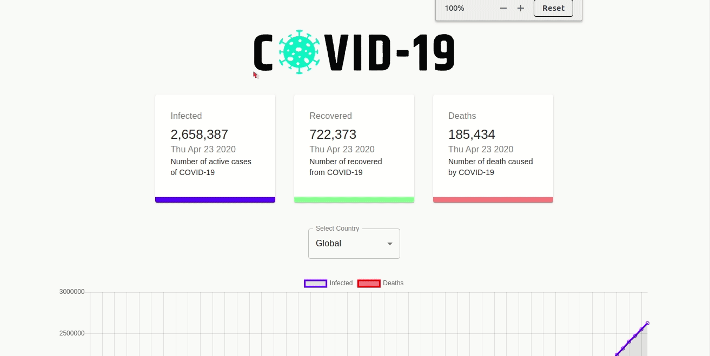

# Covid 19 Tracker

This project give you the real data of the world about the affected with covid-19.


* [Live deme](https://covid-19-tacker.herokuapp.com/)



## Getting Started

These instructions will get you a copy of the project up and running on your local machine for development and testing purposes. See deployment for notes on how to deploy the project on a live system.

### Prerequisites

This project is running under `node`, so make sure you have install.

```
NodeJs
Git
```

### Installing


Copy the below code and past in your terminal

```
git clone https://github.com/lifeeric/covid-19-tracker.git

cd react-redux-app

```

Install The Dependencies:

```
npm install

   or

yarn install
```


## Running the tests

Test The App is it running right:

```
npm devStart

or

yarn devStart
```


## Built With

* [React](http://reactjs.org/) - The web framework used
* [Npm](https://www.npmjs.com/) - Dependency Management
* [Material-ui](material-ui.com) - React UI framework
* [Axios]() - Axios for HTTP Request


## License

No License

